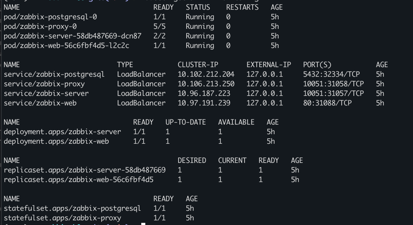

# Zabbix K8S deployment

### Automated Deployment and Management of Zabbix Monitoring Stack on Kubernetes

## Overview
- This project provides an automated setup for deploying a Zabbix monitoring stack on a local Kubernetes cluster using Ansible and Kubernetes manifests. 
- The deployment includes a Zabbix server, Zabbix frontend, PostgreSQL database, SNMP simulation, and a Zabbix proxy.
- SNMP simulation is deployed in a single pod alongside the Zabbix proxy to simulate network devices for monitoring.

## Project Structure

- `ansible/`: Contains Ansible playbooks, inventory, group variables, and required collections for automation.
- `k8s/`: Kubernetes manifests organized into subdirectories:
    - `base/`: Namespace, secrets, and configmaps foundational to the deployment.
    - `db/`: PostgreSQL database deployment manifests.
    - `snmp/`: Simulated SNMP network devices and Zabbix proxy manifests.
    - `zabbix/`: Zabbix server and frontend manifests.
- `requirements.txt`: Python dependencies for any helper scripts used in the project.

## Getting Started

### Prerequisites

- `minikube` - this project was developed and tested on a local Kubernetes cluster.
- `Podman/Docker `- container runtime for local development.
- `kubectl` - command-line tool for interacting with the Kubernetes cluster.
- `python3` and `pip` for managing Python dependencies.

### Deployment Instructions

1. Set up Minikube and start the Kubernetes cluster. 
   - `minikube start --driver=docker`
   - `minikube start --driver=podman`
2. In order to access pods and Zabbix-Web, run `minikube tunnel` in a separate terminal. Make sure K8S cluster can be accessed with localhost.
3. Run python virtual environment and install dependencies from `requirements.txt`.
   - `python -m venv venv`
   - `source venv/bin/activate`
   - `pip install -r requirements.txt`
4. Install Ansible collections from `ansible/requirements.yml`.
   - `ansible-galaxy install -r ansible/collections.yml`
5. Use Ansible playbooks to automate configuration and deployment steps as needed.
   - `ansible-playbook ansible/playbook.yml -i ansible/hosts.yml`

## Accessing the Zabbix Frontend
- The Zabbix frontend can be accessed at `http://localhost:80` with default credentials:
  - Username: `Admin`
  - Password: `zabbix`